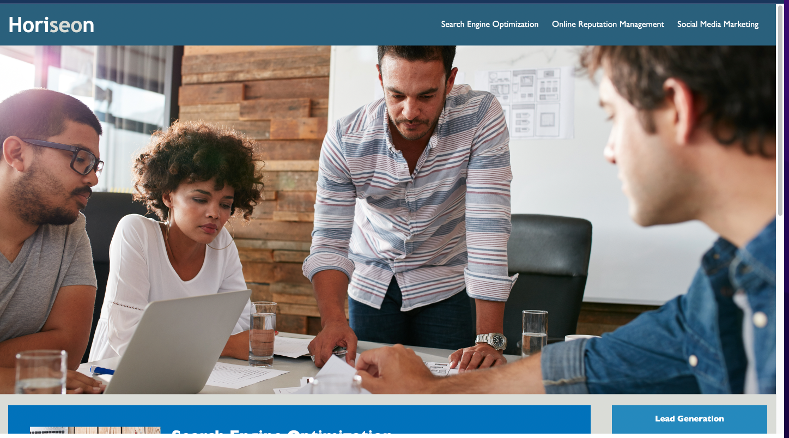

# Horiseon Webpage
This website now has a semantic structure. This file has been refactored to be more acccessible. An increasingly important consideration for businesses, web **accessibility** ensures that people with disabilities can access a website using assistive technologies like video captions, screen readers, and braille keyboards. Accessibility is good for business&mdash;for one thing, accessible sites rank higher in search engines like Google. It also helps companies avoid litigation, which might arise if people with disabilities can't access a website.

